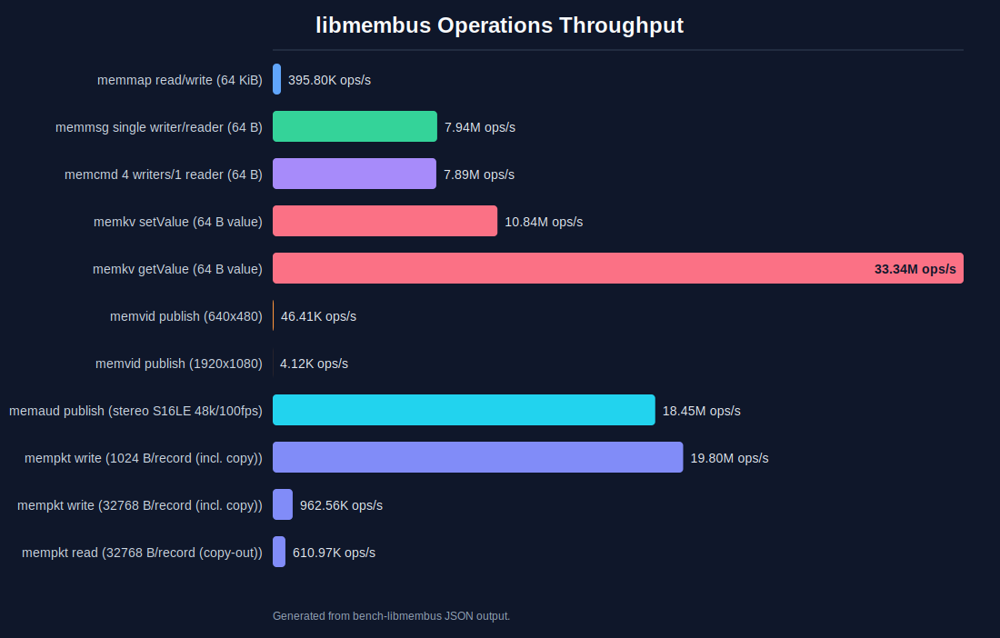
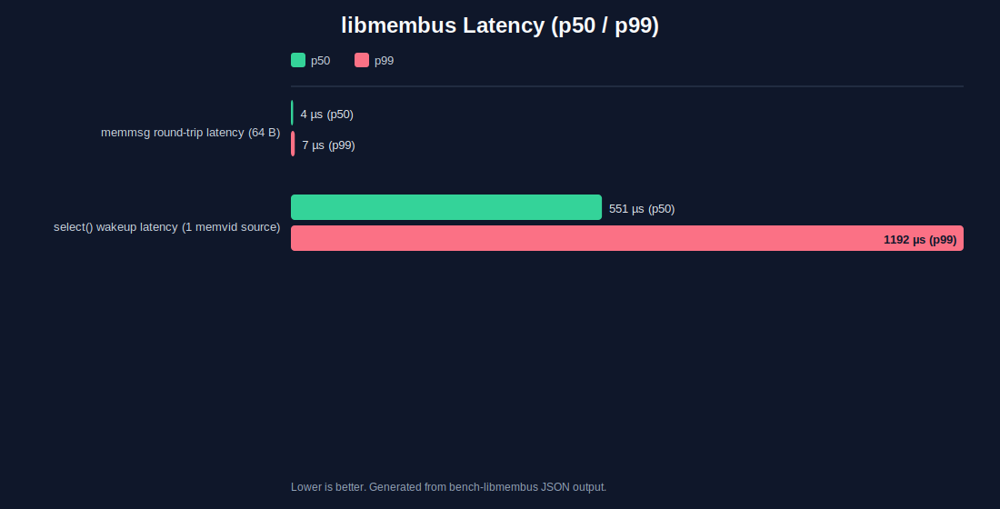

# libmembus

A C++20 shared memory data bus for inter-process communication. Provides raw memory maps, message and command channels, fixed-schema key-value state, and ring buffers for video and audio data — all backed by named shared memory with no broker process required.

## Table of Contents

- [Features](#features)
- [Requirements](#requirements)
- [Building](#building)
  - [API documentation](#api-documentation)
- [Installation](#installation)
- [Design Model](#design-model)
  - [Ownership and reader model](#ownership-and-reader-model)
  - [Overrun detection and resync](#overrun-detection-and-resync)
  - [Writer restart detection](#writer-restart-detection)
  - [Reader lifecycle](#reader-lifecycle)
  - [Command channels — multiple writers](#command-channels--multiple-writers)
- [API Reference](#api-reference)
  - [memmap — raw shared memory](#memmap--raw-shared-memory)
  - [memmsg — message queue](#memmsg--message-queue)
  - [memvid — video ring buffer](#memvid--video-ring-buffer)
  - [memaud — audio ring buffer](#memaud--audio-ring-buffer)
  - [mempkt — variable-length record ring](#mempkt--variable-length-record-ring)
  - [memcmd — command channel](#memcmd--command-channel)
  - [memkv — key-value store](#memkv--key-value-store)
  - [select — wait on multiple sources](#select--wait-on-multiple-sources)
  - [sys — signal handling](#sys--signal-handling)
- [Convenience Wrappers](#convenience-wrappers)
- [Robustness and Security](#robustness-and-security)
- [Diagnostics](#diagnostics)
- [Examples](#examples)
- [Performance](#performance)
- [Comparison to Similar Projects](#comparison-to-similar-projects)
- [License](#license)

---

## Features

- **`memmap`** — raw named shared memory buffer
- **`memmsg`** — single-producer, multi-consumer message queue with overrun detection
- **`memvid`** — lock-free multi-buffer video ring buffer with explicit packed pixel formats and overrun detection
- **`memaud`** — lock-free multi-buffer audio ring buffer with explicit sample formats and overrun detection
- **`mempkt`** — lock-free variable-length record ring for compressed / packetized streams (MJPEG, H.264, RTSP, muxed A/V); descriptor ring + packed byte arena with torn-read detection
- **`memcmd`** — multi-producer, multi-consumer broadcast command channel with overrun detection
- **`memkv`** — fixed-schema key-value store; lock-free seqlock reads, atomic batch writes, change notifications
- Presentation timestamps (`vpts`, `apts`) stored per slot in `memvid`; single `pts` field in `memaud`
- Custom / opaque pixel formats (`video_format::userType`) with caller-supplied geometry
- Format identity carried in every structured share: 32-bit `fourcc` and 128-bit `guid`
- Optional side-band metadata: one write-once main user buffer per share (SDP/SIP/JSON), plus a fixed per-frame user buffer
- Configurable payload alignment (default 64) so frame/record buffers satisfy SIMD/DMA codec requirements
- `mmb::select()` — poll any combination of sources (rings, queues, key-value) with a single blocking call
- CMake `find_package(libmembus)` support via installed config, version, and targets files
- Convenience wrappers for common reader/writer roles
- Single public include, compiled library implementation
- C++20, bool-returning open/write APIs
- Defensive validation of shared-memory headers before attaching to existing structured shares
- A shared header prefix (`magic`/`type`/`version`) makes cross-type opens (e.g. attaching to a `memvid` share as `memaud`) fail deterministically
- TOCTOU-resistant buffer accessors: `getBuf()` / `getRecord()` bounds-check all header-driven offsets at call time
- Reader handles for `memvid`, `memaud`, and `mempkt` map shared memory read-only (least-privilege)

---

## Requirements

- CMake 3.30+
- C++20 compiler
- Ninja (recommended) or Make
- Boost (`stacktrace_backtrace` component, plus Boost.Interprocess and Boost.DateTime)
- POSIX-style named shared memory is the primary tested target. The process-boundary smoke test is enabled on Unix-like platforms.

---

## Building

```bash
# Configure (first time only)
cmake . -B ./build -G Ninja

# Build and test
cmake --build ./build --parallel
```

To run tests manually:

```bash
ctest --test-dir ./build --output-on-failure
```

Run a specific test group:

```bash
ctest --test-dir ./build -R "MemMap"
ctest --test-dir ./build -R "MessageQueue"
ctest --test-dir ./build -R "MemVid"
ctest --test-dir ./build -R "MemAud"
ctest --test-dir ./build -R "MemCmd"
ctest --test-dir ./build -R "MemKV"
ctest --test-dir ./build -R "Convenience APIs"
ctest --test-dir ./build -R "memmsg poll"
ctest --test-dir ./build -R "memcmd poll"
ctest --test-dir ./build -R "select"
ctest --test-dir ./build -R "Stress"
ctest --test-dir ./build -R "ipc_smoke"
```

### API documentation

Doxygen output is disabled by default. Enable it and build the `doc` target:

```bash
cmake . -B ./build -DLIBMEMBUS_BUILD_DOCS=ON
cmake --build ./build --target doc
```

The generated HTML is written to `./build/docs/html/index.html`. Doxygen 1.9+
is required; Graphviz (`dot`) is optional — class and include graphs are
added automatically when `dot` is found.

---

## Installation

```bash
cmake --install ./build
```

Installs the library to `lib/`, headers to `include/`, and CMake package files to `lib/cmake/libmembus/`.

Downstream projects can then locate and link the library with:

```cmake
find_package(libmembus REQUIRED)
target_link_libraries(myapp PRIVATE libmembus::libmembus)
```

Point CMake at a non-system prefix with `-DCMAKE_PREFIX_PATH=/path/to/prefix`.

Examples are built by default. Disable them with:

```bash
cmake . -B ./build -DLIBMEMBUS_BUILD_EXAMPLES=OFF
```

Benchmarks are built by default. Disable them with:

```bash
cmake . -B ./build -DLIBMEMBUS_BUILD_BENCHMARKS=OFF
```

API documentation is built as an explicit target (see [API documentation](#api-documentation) above) and is off by default. Enable it persistently with:

```bash
cmake . -B ./build -DLIBMEMBUS_BUILD_DOCS=ON
```

---

## Design Model

### Ownership and reader model

The process that creates a share owns its OS namespace entry and removes it on `close()`. Processes that attach to an existing share do not remove it on close.

`memvid`, `memaud`, and `memmsg` are designed around one publishing writer and any number of independent readers. Readers never need to coordinate with each other.

```
Writer process                  Reader process A
  memvid::open(bCreate=true)      memvid::open_existing(name)
  next() / next() / ...           reads frames independently

                                Reader process B
                                  memvid::open_existing(name)
                                  reads frames independently
```

**`memvid` and `memaud`** use a fully lock-free ring buffer. The writer advances an atomic pointer via `next()`; readers observe that pointer and the per-frame sequence numbers independently without any synchronisation between readers.

**`memmsg`** uses an interprocess mutex and condition variable so readers can block-wait for messages. All readers share the same mutex but each maintains its own private read position, so every reader receives every message independently (broadcast, not work-stealing).

`memcmd` intentionally supports multiple writers and multiple registered readers. `memkv` allows any open handle to write values after the owner has created the fixed schema.

### Overrun detection and resync

The writer does not slow down or block for slow readers. If a reader falls behind by more than `getBufs()` frames (video/audio) or the write pointer laps the read position (messages), the reader is overrun. The library provides the tools to detect this reliably.

#### `memvid` / `memaud` — sequence-number lag check

`next()` atomically increments a global sequence counter in the shared header and stamps the current slot's frame header with that counter before advancing the write pointer. Readers never need to agree on a lock; they simply compare counters.

```cpp
int64_t rPos     = vid.getPtr(0);   // slot the writer will write next
int64_t rLastSeq = vid.getSeq();    // treat everything written so far as seen

while (running)
{
    int64_t lag = vid.getSeq() - rLastSeq;

    if (lag == 0)
    {
        // Nothing new yet — sleep or spin
        continue;
    }

    if (lag >= vid.getBufs())
    {
        // Writer lapped us.  Discard stale position and jump forward.
        rPos     = vid.getPtr(0);
        rLastSeq = vid.getSeq();
        // Handle dropped-frame event here if needed
        continue;
    }

    // 1 <= lag < getBufs(): data is available and the ring is intact.
    // Optionally verify the exact slot before copying:
    bool in_sync = (vid.getFrameSeq(rPos) == rLastSeq + 1);  // no gaps

    auto frame = vid.getBuf(rPos);
    // ... process frame.m_ptr ...

    rLastSeq = vid.getFrameSeq(rPos);
    rPos     = (rPos + 1) % vid.getBufs();
}
```

For tear-free reads, bracket the copy with a before/after sequence check:

```cpp
int64_t seq_before = vid.getFrameSeq(rPos);
auto view = vid.getBuf(rPos);
// ... copy pixels from view.m_ptr ...
bool torn = (vid.getFrameSeq(rPos) != seq_before);
if (torn) { /* discard and retry next frame */ }
```

#### `memmsg` — sequence-number gap check

`write()` stamps each message frame with a monotonically increasing sequence number. `read()` compares it against the last-seen sequence; a gap signals overrun. On overrun `read()` resyncs the reader's position to the current write position and returns an empty string with `*pOverrun = true`.

```cpp
mmb::memmsg rx;
rx.open("/my_queue", 1024, /*bWrite=*/false, /*bCreate=*/false);

bool overrun = false;
std::string msg = rx.read(/*wait_ms=*/100, &overrun);

if (overrun)
{
    // One or more messages were skipped; reader has been resynced.
    // Call read() again to receive the next message.
}
else if (!msg.empty())
{
    // Process msg normally.
}
```

### Writer restart detection

When the writer calls `close()` (or its process exits) the shared memory is removed from the OS namespace. Readers that were already attached keep their memory-mapped view of the old data — the map remains valid until the reader calls `close()`, but it will never be updated again.

When the writer restarts, it creates a **new** share at the same name with a fresh random session ID. Readers with stale maps will not see this automatically.

**Detection pattern** — readers should save the session ID on open and re-check it periodically. If the ID changes or `open_existing()` fails, reconnect.

```cpp
mmb::memvid vid;
if (!vid.open_existing("/my_video"))
    return; // writer not yet running

int64_t sessionId = vid.getSessionId();
int64_t rLastSeq  = vid.getSeq();
int64_t rPos      = vid.getPtr(0);

while (running)
{
    // Periodically (e.g. every second, or when getSeq() stops advancing):
    {
        mmb::memvid probe;
        if (!probe.open_existing("/my_video") ||
             probe.getSessionId() != sessionId)
        {
            // Writer restarted (or share is gone). Reconnect.
            vid.close();
            if (!vid.open_existing("/my_video"))
                break; // writer still gone, retry later
            sessionId = vid.getSessionId();
            rLastSeq  = vid.getSeq();
            rPos      = vid.getPtr(0);
        }
    }

    // Normal read loop ...
}
```

`memmsg`, `memcmd`, and `memkv` also expose `getSessionId()`. Use it the same way when an application needs to detect owner restart or stale namespace entries.

### Command channels — multiple writers

`memcmd` reverses the data-flow direction: multiple consumer processes write commands, and the capture process reads them. This is the typical pattern for camera control (pan, tilt, zoom) where any viewer may send a command at any time.

```
Consumer A ──write("pan_left")──►
Consumer B ──write("pan_stop")──► [memcmd ring buffer] ──read()──► Capture process
Consumer C ──write("zoom_in") ──►
```

Concurrent writers are serialised by the shared interprocess mutex. Every registered reader receives every command independently (broadcast). Overrun detection and resync work identically to `memmsg`.

The capture process creates the channel and registers as a reader (`bReader=true, bCreate=true`). Consumer processes attach and write without registering as readers (`bReader=false, bCreate=false`). Any open handle — reader-registered or not — may call `write()`.

See the [`memcmd` API reference](#memcmd--command-channel) for the full API.

### Reader lifecycle

| Event | Behaviour |
|---|---|
| Reader attaches while writer runs | `open_existing()` maps to the live share; start with `rLastSeq = getSeq()` and `rPos = getPtr(0)` |
| Reader falls behind by < `getBufs()` frames | Data is still in the ring; reader can catch up or skip |
| Reader is lapped (`lag >= getBufs()`) | Detected via sequence check; reader resyncs and signals caller |
| Reader disconnects cleanly | `close()` unmaps memory; share is not removed (reader opened with `existing() == true`) |
| Reader crashes | Same as clean disconnect from the writer's perspective |
| Writer stops cleanly | Share is removed from namespace; readers' maps go stale; `getSeq()` stops advancing |
| Writer crashes | Share lingers in namespace; `getSeq()` stops advancing; next writer restart removes the stale share and creates a fresh one |
| Writer restarts | New share, new session ID; existing readers detect via `getSessionId()` change and reconnect |

---

## API Reference

All types live in the `mmb` namespace. Include the single top-level header:

```cpp
#include "libmembus.h"
```

---

### memmap — raw shared memory

```cpp
mmb::memmap writer, reader;

// Create a 1 KB shared memory region
writer.open("/my_share", 1024, /*bCreate=*/true, /*bNew=*/true);

// Attach from another process (read-write)
reader.open("/my_share", 1024, /*bCreate=*/false, /*bNew=*/false);

// Attach read-only
reader.open("/my_share", 0, false, false, /*bReadOnly=*/true);

// Write and read raw strings
writer.write("hello");
std::string data = reader.read(5);  // read up to 5 bytes
std::string all  = reader.read();   // read entire buffer

// Inspect state
writer.isOpen();    // true
reader.existing();  // true — share already existed when opened
writer.size();      // 1024
writer.name();      // "/my_share"
char* ptr = writer.data();  // raw pointer
```

`open()` parameters:

| Parameter | Description |
|-----------|-------------|
| `sName`    | Share name (POSIX: must start with `/`) |
| `nSize`    | Size in bytes |
| `bCreate`  | Create if it does not exist |
| `bNew`     | Unlink and recreate if it already exists |
| `bReadOnly`| Map read-only; forces `bCreate=false` and `bNew=false` |

The process that created the share (`existing() == false`) owns it and removes it from the namespace on `close()`. Processes that attached to an existing share (`existing() == true`) do not remove it on close.

Opening an existing share with `bCreate=true` does not resize it. `nSize` is used to size newly-created shares; attached handles report the actual mapped size via `size()`.

Use `memmap::remove(name)` to explicitly clean up a stale share from the OS namespace.

---

### memmsg — message queue

Single-producer, multi-consumer broadcast queue. Every reader receives every message independently. The writer opens with `bWrite=true`; readers open with `bWrite=false`.

```cpp
mmb::memmsg tx, rx;

tx.open("/my_queue", 1024, /*bWrite=*/true,  /*bCreate=*/true);
rx.open("/my_queue", 1024, /*bWrite=*/false, /*bCreate=*/false);

tx.write("hello");

// Blocking read — wait up to 100 ms
bool overrun = false;
std::string msg = rx.read(100, &overrun);

// Non-blocking read
std::string msg2 = rx.read(0);
```

**`write(msg)`** returns `false` if the message is empty or too large for the buffer.

**`read(wait_ms, pOverrun)`**

| Return | Meaning |
|---|---|
| Non-empty string, `*pOverrun = false` | Message received normally |
| Empty string, `*pOverrun = false` | Timed out with no message |
| Empty string, `*pOverrun = true` | Reader was lapped; position resynced — call `read()` again |

**`poll()`** — non-blocking check; returns `true` if at least one message is waiting to be read.  Reads the write pointer without acquiring the mutex, so the result may be momentarily stale; false wakeups are rare and acceptable.  Intended for use with `mmb::select()`.

Notes:
- Both sides must open with the same `size` or the attach will fail.
- Attach also fails if an existing share is too small for the requested queue layout.
- The internal mutex is acquired with a 5-second timeout; if the writer crashes holding the lock, readers will surface an error rather than blocking forever.
- Frame records in the ring are padded to 8-byte alignment so that `int64_t` header fields in adjacent frames are always naturally aligned.  Shares created by older versions of the library (without alignment padding) are not compatible; close and reopen them.
- `getSessionId()` returns the random ID written when the queue was created.
- `memmsg::remove(name)` removes a stale queue from the namespace.

---

### memvid — video ring buffer

Lock-free ring buffer of raw packed video frames. The writer calls `next()` to publish each frame; readers observe the write pointer and per-frame sequence numbers independently.

```cpp
mmb::memvid producer, consumer;

// Create: 1920x1080 RGB24, 30fps, 4-frame ring buffer
producer.open("/my_video", /*bCreate=*/true,
              1920, 1080, mmb::video_format::rgb24, 30, /*bufs=*/4);

// Attach from another process (with known parameters)
consumer.open("/my_video", false, 1920, 1080, mmb::video_format::rgb24, 30, 4);

// Attach without knowing the parameters
consumer.open_existing("/my_video");

// Write: fill slot 0 with solid colour, then publish and advance pointer
producer.fill(0, 0xFF);
producer.next(1);

// Read: get the most recently completed frame
int64_t rPos = consumer.getPtr(-1);  // slot written just before the write pointer
mmb::memvid::vidview frame = consumer.getBuf(rPos);
// frame.m_ptr  — raw pixel data
// frame.m_w    — width
// frame.m_h    — height
// frame.m_sw   — scan width (bytes per row)
// frame.m_format — pixel format
// frame.m_size — total bytes (m_sw * m_h)
```

`open_existing()` validates the header, rejects malformed or undersized shares before exposing buffer views, and maps the segment **read-only** (least-privilege).  The writer always uses `open()` with `bCreate=true`, which maps read-write.

`getBuf()` snapshots all header fields at call time and bounds-checks the computed slot offset against the mapped size before returning.  A peer that modifies header fields after `open_existing()` returns will cause `getBuf()` to throw rather than produce an out-of-bounds pointer.

**Pointer and sequence helpers:**

| Method | Description |
|--------|-------------|
| `setPtr(p)` | Set the write pointer to `p` (wrapped); returns `p` |
| `getPtr(offset)` | Return `(ptr + offset) % bufs` |
| `next(inc)` | Stamp current slot's sequence, advance pointer by `inc` |
| `getPtrErr(pos, bias)` | Signed circular distance from `ptr+bias` to `pos` |
| `getSeq()` | Global write-sequence counter (incremented by every `next()`) |
| `getFrameSeq(idx)` | Sequence number stamped in slot `idx`; 0 means never written |
| `getSessionId()` | Random ID written at share creation; changes on every writer restart |
| `waitForFrame(wait_ms, lastSeq)` | Poll until `getSeq() > lastSeq` or timeout |

**Presentation timestamps:**

Each frame slot carries two independent 64-bit timestamp fields — `vpts` (video) and `apts` (companion audio).  The values are application-defined; the library stores and retrieves them verbatim.  Write them after filling pixel data and before calling `next()`.

| Method | Description |
|--------|-------------|
| `setVpts(idx, pts)` | Write the video presentation timestamp into slot `idx` |
| `getVpts(idx)` | Read the video presentation timestamp from slot `idx` |
| `setApts(idx, pts)` | Write the audio presentation timestamp into slot `idx` |
| `getApts(idx)` | Read the audio presentation timestamp from slot `idx` |

```cpp
// Writer
producer.fill(slot, 0x00);
producer.setVpts(slot, video_pts_us);
producer.setApts(slot, audio_pts_us);
producer.next(1);

// Reader
auto frame = consumer.getBuf(rPos);
int64_t vpts = consumer.getVpts(rPos);
int64_t apts = consumer.getApts(rPos);
```

**Metadata:**

| Method | Description |
|--------|-------------|
| `getWidth()` | Frame width in pixels |
| `getHeight()` | Frame height in pixels |
| `getFormat()` | Pixel format enum |
| `getFormatName()` | Pixel format name |
| `getFps()` | Frames per second |
| `getBufs()` | Number of slots in the ring |

Supported video formats are stored in the shared-memory header as an `int64_t` at `memvid::hv_format`:

| Format name | Header value | Bytes per pixel |
|---|---:|---:|
| `gray8` | `1` | 1 |
| `rgb24` | `2` | 3 |
| `bgr24` | `3` | 3 |
| `rgba32` | `4` | 4 |
| `bgra32` | `5` | 4 |
| `yuyv422` | `6` | 2 |
| `uyvy422` | `7` | 2 |
| `userType` | `0x1000` | caller-supplied |

The YUV 4:2:2 formats are packed and require an even frame width.

**Custom / opaque formats:** pass `video_format::userType` with an explicit
`scanwidth` (bytes per row).  The library treats the payload as opaque and
carries geometry from the caller; the concrete format is identified by the
`fourcc` / `guid` fields (below).  `video_format_bytes_per_pixel(userType)`
returns `0`.

**Identity and side-band metadata (shared by `memvid`, `memaud`, `mempkt`):** the
extended `open()` accepts optional trailing arguments — `align` (payload
alignment, default 64), `frameextra` (fixed per-frame user-buffer size), `fourcc`,
`guid` (16 bytes), and `meta` / `metasz` (a write-once main user buffer for
SDP/SIP/JSON session config).  The existing positional parameters are unchanged,
so current callers compile without modification.

| Method | Description |
|--------|-------------|
| `getFourcc()` / `getGuid(out)` | Format identity (fourcc; 16-byte GUID) |
| `getMeta()` / `getMetaSize()` | Main user metadata buffer |
| `getAlign()` | Payload alignment in bytes |
| `getFrameExtra()` | Per-frame user-buffer stride |
| `setUserData(idx, p, n)` / `getUserData(idx)` / `getUserLen(idx)` | Per-frame user buffer |

**Payload alignment:** each frame's pixel data starts on an `align`-byte boundary
(default 64), and the per-slot `int64_t` header fields are always naturally
aligned regardless of frame geometry.

**Wire-format note:** the header layout is version `2` and begins with a shared
`magic`/`type`/`version` prefix common to `memvid`, `memaud`, and `mempkt`.  This
is a breaking change from earlier layouts — close and recreate any live shares
after upgrading; old shares fail validation cleanly.

---

### memaud — audio ring buffer

Same lock-free ring-buffer model as `memvid` but for PCM audio buffers.

```cpp
mmb::memaud producer, consumer;

// Create: stereo S16LE, 44100 Hz sample rate, 30 buffers/sec, 3-buffer ring
producer.open("/my_audio", /*bCreate=*/true,
              /*ch=*/2, mmb::audio_format::s16le, /*sampleRate=*/44100,
              /*fps=*/30, /*bufs=*/3);

consumer.open("/my_audio", false, 2, mmb::audio_format::s16le, 44100, 30, 3);
// Or:
consumer.open_existing("/my_audio");

// Write
producer.fill(0, 0x00);  // silence
producer.next(1);

// Read
mmb::memaud::audview buf = consumer.getBuf(consumer.getPtr(-1));
// buf.m_ptr  — raw sample data
// buf.m_size — size in bytes
// buf.m_ch   — channels
// buf.m_format — sample format
```

`open_existing()` validates the header, rejects malformed or undersized shares before exposing buffer views, and maps the segment **read-only** (least-privilege).

`getBuf()` snapshots all header fields at call time and bounds-checks the computed slot offset against the mapped size before returning.

**Buffer size note:** the samples-per-frame count is computed as `⌈sampleRate / fps⌉` (ceiling division).  This ensures each buffer holds at least one full frame's worth of audio even when the rates do not divide evenly, preventing long-running clock drift.  `getBufSize()` returns the actual byte count per buffer.

`memaud` shares the same optional identity / side-band-metadata parameters and accessors as `memvid` (`fourcc`, `guid`, `align`, `frameextra`, `meta`; `getFourcc`, `getGuid`, `getMeta`, `setUserData`, …).

**Wire-format note:** the header layout is version `2` with the shared `magic`/`type`/`version` prefix common to `memvid`, `memaud`, and `mempkt`.  This is a breaking change from earlier layouts; close and recreate any live shares after upgrading.

**Metadata:**

| Method | Description |
|--------|-------------|
| `getChannels()` | Number of channels |
| `getFormat()` | Sample format enum |
| `getFormatName()` | Sample format name |
| `getBytesPerSample()` | Bytes per sample for one channel |
| `getSampleRate()` | Sample rate in Hz |
| `getFps()` | Buffers per second |
| `getBufs()` | Number of slots in the ring |
| `getBufSize()` | Bytes per buffer |

**Presentation timestamp:**

Each buffer slot carries a single 64-bit `pts` field.  Write it after filling sample data and before calling `next()`.

| Method | Description |
|--------|-------------|
| `setPts(idx, pts)` | Write the presentation timestamp into slot `idx` |
| `getPts(idx)` | Read the presentation timestamp from slot `idx` |

The pointer/sequence/session helpers (`setPtr`, `getPtr`, `next`, `getPtrErr`, `getSeq`, `getFrameSeq`, `getSessionId`) work identically to the `memvid` equivalents.
`waitForFrame(wait_ms, lastSeq)` is also available and follows the same polling semantics.

Supported audio formats are stored in the shared-memory header as an `int64_t` at `memaud::hv_format`:

| Format name | Header value | Bytes per sample |
|---|---:|---:|
| `u8` | `1` | 1 |
| `s16le` | `2` | 2 |
| `s24le` | `3` | 3 |
| `s32le` | `4` | 4 |
| `f32le` | `5` | 4 |
| `f64le` | `6` | 8 |

---

### mempkt — variable-length record ring

Lock-free ring for **variable-length, opaque** records — intended for compressed
or packetized streams (MJPEG, H.264/HEVC access units, RTSP payloads, muxed A/V,
or arbitrary application data) where `memvid`/`memaud`'s fixed-size slots do not
fit.  Single-writer, multiple-reader, like the other rings.

Internally it is a **descriptor ring + packed byte arena**: a fixed array of
descriptors gives O(1) addressing and overrun detection, while the variable
payloads live in a separate arena.  Because the arena is overwritten in place,
readers copy a record out and then re-check a monotonic write-cursor to confirm
the bytes were not lapped mid-copy (all handled inside `getRecord()`).

```cpp
mmb::mempkt_writer w;
// 16 descriptor slots, 1 MiB arena, records up to 256 KiB, fourcc 'MJPG'
w.open("/my_stream", /*bufs=*/16, /*arenasz=*/1<<20, /*maxrec=*/256<<10,
       /*align=*/64, /*fourcc=*/0x47504a4du);

// Publish a compressed frame (kind, track, pts, optional per-record metadata)
w.write(jpeg.data(), (int64_t)jpeg.size(), mmb::pkt_kind::video, /*track=*/0, pts_us);

mmb::mempkt_reader r;
r.open("/my_stream");

std::string payload, meta;
mmb::mempkt::recinfo info;
bool overrun = false;
if (r.wait(100) && r.readNext(payload, meta, info, &overrun) && !overrun) {
    // payload — the record bytes; info.pts / info.kind / info.track — descriptor fields
}
```

**Sizing (`arenasz` vs `maxrec`):** `arenasz` must be at least `maxrec`, but sizing
it *to* that floor livelocks readers — a full-size record is overwritten almost
immediately.  Give the arena headroom (several × `maxrec`, or `bufs × typical
record`) so readers have time to copy records out.

**Capacities and identity:**

| Method | Description |
|--------|-------------|
| `getBufs()` | Number of descriptor slots |
| `getArenaSize()` | Payload arena size in bytes |
| `getMaxRec()` | Largest single record (payload + metadata) accepted |
| `getWcursor()` | Live monotonic arena write-cursor |
| `getFourcc()` / `getGuid(out)` | Format identity |
| `getMeta()` / `getMetaSize()` | Main user metadata buffer (write-once) |

The pointer/sequence/session helpers (`getPtr`, `getSeq`, `getFrameSeq`,
`getSessionId`, `waitForFrame`) mirror the `memvid` equivalents; the descriptor
ring uses the same lag-based overrun check.  `write()` returns `-1` and sets
`errc::message_too_large` when `payload + metadata` exceeds `maxrec`.

Per-record fields let a single ring carry muxed content: `kind`
(`pkt_kind::video` / `audio` / `data`), `track` (stream id; low 32 bits may carry
a fourcc), `pts`, and an optional per-record metadata blob returned alongside the
payload.

---

### memcmd — command channel

Multi-producer, multi-consumer broadcast command channel. Any open handle may write; every registered reader receives every message independently. Designed for the reverse data-flow case: consumer processes send control commands to the capture process.

```cpp
// Capture process — creates the channel and registers as a reader
mmb::memcmd cmd;
cmd.open("/cam_commands", 4096, /*bReader=*/true, /*bCreate=*/true);

while (running) {
    bool overrun = false;
    std::string c = cmd.read(/*wait_ms=*/100, &overrun);
    if (overrun) { /* some commands were skipped */ continue; }
    if (c == "pan_left")  camera.pan(-1);
    if (c == "pan_stop")  camera.stop();
}

// Consumer process — attaches and sends a command (defaults: bReader=false, bCreate=false)
mmb::memcmd cmd;
if (cmd.open("/cam_commands", 4096))
    cmd.write("pan_left");
```

**`open(sName, size, bReader, bCreate)`**

| Parameter | Description |
|-----------|-------------|
| `sName`   | Share name (POSIX: must start with `/`) |
| `size`    | Ring buffer capacity in bytes |
| `bReader` | Register as a reader (increments `readerCount()`); default `false` |
| `bCreate` | Create the share if it does not exist; default `false` |

The process that creates the share owns it and removes it from the OS namespace on `close()`. Both sides must open with the same `size` or the attach will fail.
Attach also fails if an existing share is too small for the requested command-channel layout.

Frame records in the ring are padded to 8-byte alignment (same as `memmsg`); shares created by older library versions are not compatible.

**`write(msg)`** — returns `false` if the payload is empty, too large for the buffer, or the mutex could not be acquired within 5 seconds (crash recovery).

**`read(wait_ms, pOverrun)`**

| Return | Meaning |
|---|---|
| Non-empty string, `*pOverrun = false` | Command received normally |
| Empty string, `*pOverrun = false` | Timed out with no command |
| Empty string, `*pOverrun = true` | Reader was lapped; position resynced — call `read()` again |

**`poll()`** — non-blocking check; returns `true` if at least one command is waiting to be read.  Reads the write pointer without acquiring the mutex; intended for use with `mmb::select()`.

**`readerCount()`** — number of handles currently opened with `bReader=true`. Treat as a hint; may be temporarily stale if a reader crashed before calling `close()`.

**`getSessionId()`** — random ID written when the channel was created.

**`memcmd::remove(name)`** — removes a stale command channel from the namespace.

---

### memkv — key-value store

Fixed-schema shared memory key-value store. The owner creates it with a slot count and maximum name/value lengths; those are immutable for the lifetime of the share. Any process may read or write values after attaching.

**Writes** are serialised by an interprocess mutex. **Reads** are lock-free via a per-slot seqlock: readers never acquire any lock. If a write is in progress on a slot the reader retries (nanoseconds per retry); a stuck seqlock after 1000 retries sets `*pStale = true` to signal a possible writer crash.

```cpp
// Owner — creates the store and populates names before publishing
mmb::memkv kv;
kv.create("/cam_state", 4, /*maxNameLen=*/31, /*maxValueLen=*/63);
kv.setName(0, "pan");   kv.setValue(0, "0");
kv.setName(1, "tilt");  kv.setValue(1, "0");
kv.setName(2, "zoom");  kv.setValue(2, "1.0");
kv.setName(3, "focus"); kv.setValue(3, "auto");

// Write a single value
kv.setValue("pan", "-15");

// Write multiple values atomically (one epoch increment, one notify)
kv.setAll({{"pan", "-15"}, {"tilt", "5"}, {"zoom", "1.4"}});

// Any other process
mmb::memkv reader;
reader.open("/cam_state");

// Lock-free read
std::string pan = reader.getValue("pan");

// Consistent snapshot of all entries
auto all = reader.getAll();

// Poll for changes (non-blocking)
int64_t epoch = reader.getEpoch();
auto changed = reader.getChanged(epoch);    // returns map of changed entries, updates epoch

// Wait for changes (blocking)
changed = reader.getChanged(100, epoch);    // blocks up to 100 ms
```

**`create(sName, count, maxNameLen, maxValueLen, bNew=false)`** — creates the share; optionally removes any stale share first with `bNew=true`.

**`open(sName)`** — attaches to an existing share. Reads schema (count, name/value limits) from the header and rejects malformed or undersized layouts.

**`setName(idx, name)`** — sets the immutable name for slot `idx`. Call only before other processes attach.

**`setValue(idx|name, value)`** — mutex-protected write to a single slot. Returns false if the value exceeds `maxValueLen` or the lock times out (5 s, crash recovery).

**`setAll(map)`** — writes every entry under one mutex acquisition. All slots change atomically. Names not in the store are silently skipped.  The epoch is incremented and `waitForChange` callers are notified **only** when at least one slot was actually written; an all-unknown or empty map is a no-op.

**`getValue(idx|name, pStale)`** — lock-free seqlock read. `pStale` is set true if the seqlock was stuck (writer crash indicator).

**`getAll()`** — epoch-checked consistent snapshot: retries until a complete pass finishes with no concurrent write, capped at 100 attempts to prevent livelock under sustained write pressure.  Returns the best-effort snapshot if the cap is reached.

**`getChanged(epoch)`** — non-blocking; returns a map of every slot whose value changed since `epoch`; updates `epoch` to the current value.

**`getChanged(wait_ms, epoch)`** — blocking; waits up to `wait_ms` for any change, then returns changed slots. Empty map on timeout.

**`waitForChange(wait_ms, epoch)`** — blocks until epoch advances; returns true if a change occurred, false on timeout.

**`getSessionId()`** — random ID written when the store was created.

**`memkv::remove(name)`** — removes a stale key-value store from the namespace.

**Owner crash recovery** — `getValue()` caps retries at 1000 (sets `*pStale = true` if stuck). `waitForChange()` / `setValue()` / `setAll()` fail with false after a 5 s lock timeout. Application-level recovery: monitor `waitForChange()` timeouts, then `close()` and `open()` to reconnect.

---

### select — wait on multiple sources

`mmb::select()` blocks until any one of a list of conditions becomes true, or a timeout expires.  Conditions are polled round-robin at ~1 ms intervals, making it suitable for any mix of source types without requiring a unified wake-up mechanism.

```cpp
mmb::memvid_reader  vid;  vid.open("/video");
mmb::memcmd_receiver cmd; cmd.open("/commands", 4096);

int64_t vidSeq = vid.raw().getSeq();

while (running) {
    int idx = mmb::select(/*wait_ms=*/100, {
        [&]{ return vid.raw().getSeq() > vidSeq; },  // index 0 — new video frame
        [&]{ return cmd.raw().poll(); }               // index 1 — new command
    });

    if (idx == 0) {
        auto frame = vid.readNext();
        // ... process frame.m_ptr ...
        vidSeq = vid.raw().getSeq();
    }
    if (idx == 1) {
        std::string c = cmd.read(0);
        // ... handle command ...
    }
    // idx == -1 means the 100 ms timeout elapsed with nothing ready
}
```

`mmb::select(wait_ms, conditions)` returns the **zero-based index** of the first ready condition, or **-1** on timeout.  Pass `wait_ms = 0` for a single non-blocking pass.

The conditions list may hold any `bool()` callable, so any source type works:

| Source type | Readiness condition |
|---|---|
| `memvid` / `memaud` | `vid.getSeq() > lastSeq` |
| `memmsg` / `memcmd` | `q.poll()` |
| `memkv` | `kv.getEpoch() > lastEpoch` |
| Custom | Any `std::function<bool()>` |

A `std::vector<std::function<bool()>>` overload is also provided for dynamically assembled condition lists.

---

### sys — signal handling

```cpp
static volatile int ctrl_c_count = 0;
mmb::install_ctrl_c_handler(&ctrl_c_count);

while (!ctrl_c_count)
{
    // do work
}
// pressing Ctrl-C three times exits immediately
```

`ctrl_c_count` is incremented each time Ctrl-C is pressed. Once the count exceeds 3 (i.e. after the fifth press) the process calls `_exit(1)` immediately, bypassing any further cleanup.

---

## Convenience Wrappers

The core classes remain available directly, but `libmembus.h` also includes small role-oriented wrappers for common patterns:

| Wrapper | Underlying type | Role |
|---|---|---|
| `memmsg_writer` | `memmsg` | Creates/writes a single-producer message queue |
| `memmsg_reader` | `memmsg` | Attaches/reads a message queue |
| `memcmd_sender` | `memcmd` | Attaches and writes commands |
| `memcmd_receiver` | `memcmd` | Creates/attaches as a registered command reader |
| `memvid_writer` | `memvid` | Creates a video ring; publishes frames with optional `setVpts`/`setApts` |
| `memvid_reader` | `memvid` | Opens an existing video ring; `readNext()` caches timestamps in `lastVpts()`/`lastApts()` |
| `memaud_writer` | `memaud` | Creates an audio ring; publishes buffers with optional `setPts` |
| `memaud_reader` | `memaud` | Opens an existing audio ring; `readNext()` caches the timestamp in `lastPts()` |
| `mempkt_writer` | `mempkt` | Creates a record ring; publishes variable-length records with `write()` |
| `mempkt_reader` | `mempkt` | Opens an existing record ring; `readNext()` copies out the next record with overrun detection |

Example:

```cpp
mmb::memcmd_receiver receiver;
mmb::memcmd_sender sender;

receiver.open("/commands", 4096);
sender.open("/commands", 4096);

sender.write("pan_left");
std::string cmd = receiver.read(100);
```

The wrappers intentionally stay thin. Call `raw()` when you need direct access to the underlying object.

The `memvid_writer` timestamp helpers write to the **current write slot** (the slot that will be published on the next `next()` call).  The `memvid_reader` and `memaud_reader` helpers cache the timestamps from the most recently returned slot so they can be read after `readNext()` returns.

`memaud_writer::open` does not accept a `bNew` parameter — `memaud::open` always removes and recreates the share when `bCreate=true`.  Use `memaud::remove(name)` explicitly beforehand if you need conditional teardown.

---

## Robustness and Security

### Shared-memory trust model

Named shared memory is accessible to any process with filesystem read/write
permission on the segment.  libmembus is designed for cooperative IPC between
processes in the same security domain.  It is not a safe channel between
mutually distrusting processes.

### Header validation

All structured shares (`memmsg`, `memcmd`, `memvid`, `memaud`, `mempkt`, `memkv`)
validate their shared-memory headers before attaching:

- Schema fields are checked against expected values; mismatched or undersized
  shares are rejected.
- `memvid`, `memaud`, and `mempkt` share a header prefix carrying a `magic`
  constant and a `type` discriminator, checked first — so attaching to a share of
  the wrong class (e.g. opening a `memvid` share as `memaud`) fails deterministically
  rather than by coincidence of the layout math.
- `memvid::open_existing`, `memaud::open_existing`, and `mempkt::open_existing`
  run a full layout consistency check and map the segment **read-only**.
- `getBuf()` (`memvid`/`memaud`) and `getRecord()` (`mempkt`) snapshot header
  fields locally and bounds-check every computed offset against the mapped size on
  every call, using overflow-checked arithmetic.  A peer that modifies `hv_bufs`,
  `hv_blocksz`, `hv_descstride`, or related fields after the initial validation
  causes the accessor to fail (throw / return `false`) rather than produce an
  out-of-bounds pointer.
- `mempkt` records are copied out of the arena and then re-validated against a
  monotonic write-cursor, so a reader lapped mid-copy discards the record instead
  of returning torn bytes.

For `memmsg` and `memcmd`, the reader must acquire the shared interprocess mutex
(stored inside the segment), which requires read-write mapping.  Those types
therefore cannot use read-only protection.

### Crash recovery

All mutex-protected operations (`memmsg::write/read`, `memcmd::write/read`,
`memkv::setValue/setAll/waitForChange`) use a 5-second timed lock.  If the
owning process crashes while holding the mutex, waiting processes surface
`errc::lock_timeout` rather than blocking forever.

### Error reporting

The library never writes to `stdout` or `stderr`.  All failure reasons are
communicated through `bool` return values and `mmb::last_error()` /
`mmb::last_error_message()`.

---

## Diagnostics

Most APIs return `bool`, numeric status, or an empty string on failure. The thread-local diagnostic helpers provide the last error category:

```cpp
if (!queue.open("/my_queue", 1024, false, false))
    std::cerr << mmb::last_error_message() << "\n";
```

Available values include `invalid_argument`, `open_failed`, `create_failed`, `map_failed`, `size_mismatch`, `invalid_layout`, `not_open`, `access_denied`, `message_too_large`, `lock_timeout`, `timeout`, and `overrun`.

---

## Examples

Runnable examples live in `examples/` and are built by default:

```bash
./build/examples/example-memmsg_pingpong
./build/examples/example-memcmd_control
./build/examples/example-memkv_state
./build/examples/example-memvid_dummy_frames
```

They are intentionally small and cover the common happy-path setup for each abstraction family.

---

## Performance

The benchmark harness covers two categories:

**Throughput** — single-process, in-memory loops that measure raw ops/sec and MiB/sec.  Useful for comparing per-operation cost across API families; results vary with CPU, kernel, compiler flags, and scheduler noise.

> **Note on `mempkt`:** its "publish" figure includes a real payload `memcpy` into the arena, whereas the `memvid`/`memaud` "publish" figures are a `fill()` (`memset`) + `next()` with no copy — so the MiB/sec numbers are not directly comparable across those groups.  `mempkt read` measures the full consume path (`getRecord()`: seqlock + arena copy-out + write-cursor re-check), which is the one read-side cost the other rings avoid by handing back zero-copy views.

**Latency** — two-thread measurements that capture end-to-end timing percentiles (p50/p95/p99):

- `memmsg round-trip latency` — a ping-pong between two threads sharing a message queue.  Each sample is the time from `write()` to the echo reply being received.  Dominated by two condvar wakeup / mutex-acquisition cycles (one per direction) and approximates real cross-process latency.
- `select() wakeup latency` — time from a writer calling `next()` on a `memvid` ring to `mmb::select()` returning in the reader thread.  Because `select()` polls at 1 ms intervals the distribution is roughly uniform over [0, 1 ms], so the p50 sits near 500 µs and the p99 sits near the poll interval ceiling.

Run the benchmarks and regenerate the artifacts:

```bash
./build/bench/bench-libmembus --duration-ms 1000 --json bench/results/latest.json
python3 bench/plot_results.py bench/results/latest.json bench/results
```






Latest generated summary:

<!-- BEGIN BENCHMARK SUMMARY -->
<!-- Generated by bench/plot_results.py. Do not edit by hand. -->

Benchmark duration: `1000 ms` per case

System: `Linux 6.19.14+kali-amd64 x86_64`

**Throughput** (higher is better):

| Benchmark | Payload | Ops/sec | MiB/sec | ns/op |
|---|---:|---:|---:|---:|
| memmap read/write | 64 KiB | 395.80K | 49474.5 | 2526.6 |
| memmsg single writer/reader | 64 B | 7.94M | 484.3 | 126.0 |
| memcmd 4 writers/1 reader | 64 B | 7.89M | 481.7 | 126.7 |
| memkv setValue | 64 B value | 10.84M | 661.8 | 92.2 |
| memkv getValue | 64 B value | 33.34M | 2034.7 | 30.0 |
| memvid publish | 640x480 | 46.41K | 40791.4 | 21546.3 |
| memvid publish | 1920x1080 | 4.12K | 24460.1 | 242542.0 |
| memaud publish | stereo S16LE 48k/100fps | 18.45M | 33792.2 | 54.2 |
| mempkt write | 1024 B/record (incl. copy) | 19.80M | 19339.1 | 50.5 |
| mempkt write | 32768 B/record (incl. copy) | 962.56K | 30080.0 | 1038.9 |
| mempkt read | 32768 B/record (copy-out) | 610.97K | 19092.8 | 1636.7 |

**Latency** (lower is better):

| Benchmark | Payload | Samples | p50 µs | p95 µs | p99 µs |
|---|---:|---:|---:|---:|---:|
| memmsg round-trip latency | 64 B | 252578 | 4 | 5 | 6 |
| select() wakeup latency | 1 memvid source | 196 | 579 | 1117 | 1253 |
<!-- END BENCHMARK SUMMARY -->

Generated files:

- `bench/results/latest.json`
- `bench/results/summary.md`
- `bench/results/throughput_ops.svg`
- `bench/results/throughput_mib.svg`
- `bench/results/latency.svg`

---

## Comparison to Similar Projects

Several projects solve shared-memory IPC in different ways. The right choice depends on whether you need a small embeddable C++ library, a full middleware stack, durable queues, or low-level shared-memory primitives.

---

### Boost.Interprocess

Boost.Interprocess is the closest low-level foundation. It provides shared memory, mapped files, named synchronization primitives, process-shared mutexes and condition variables, message queues, and shared-memory allocators/containers.

Key differences:

- Boost.Interprocess is a general-purpose toolkit. libmembus is a higher-level set of fixed IPC patterns built on Boost.Interprocess-style primitives.
- Boost.Interprocess gives you raw mechanisms; you design your own message framing, overrun handling, restart detection, and media/state layouts.
- libmembus provides ready-made `memmsg`, `memcmd`, `memvid`, `memaud`, and `memkv` abstractions with tests for process-boundary behavior.
- Boost.Interprocess is more flexible and portable; libmembus is smaller and more opinionated.

Choose Boost.Interprocess if you need maximum control over the shared-memory layout or want STL-like containers and allocators in shared memory.

Choose libmembus if you want a compact library with predefined message, command, media-ring, and key-value patterns.

---

### cpp-ipc / libipc

cpp-ipc is a high-performance C++ IPC library using shared memory and circular buffers. It supports single-writer/multi-reader routes and multi-reader/multi-writer channels with broadcast-style delivery.

Key differences:

- cpp-ipc is closest to `memmsg` and `memcmd`: shared-memory channels, circular buffers, timeouts, and broadcast delivery.
- cpp-ipc is more focused on generic message channels. libmembus also includes typed-ish domain buffers for video, audio, and fixed-schema key-value state.
- cpp-ipc has broader packaged ecosystem support through package managers such as vcpkg and Conan.
- libmembus currently has a smaller API surface and fewer dependencies beyond Boost.

Choose cpp-ipc if you mainly need high-performance generic IPC channels across several platforms.

Choose libmembus if your application also needs shared video/audio frame rings or simple shared process state.

---

### Eclipse iceoryx

Eclipse iceoryx is a true zero-copy shared-memory IPC middleware designed for high-throughput publish/subscribe systems, especially robotics, automotive, and real-time applications.

Key differences:

- iceoryx is middleware with service discovery, publishers/subscribers, and integration paths for larger ecosystems such as ROS 2 and AUTOSAR Adaptive.
- libmembus is a small library with named shares and no daemon, discovery service, or framework-level routing.
- iceoryx is designed for large zero-copy data flows and stricter safety-oriented environments.
- libmembus is easier to inspect and embed when a few named local process channels are enough.

Choose iceoryx if you need a production middleware layer, discovery, many publishers/subscribers, and strong zero-copy semantics.

Choose libmembus if you want direct named shared-memory channels with minimal infrastructure.

---

### Eclipse eCAL

Eclipse eCAL is a communication middleware with publish/subscribe, client/server, shared-memory transport, network transports, recording/replay tools, and multiple language bindings.

Key differences:

- eCAL supports interprocess and interhost communication. libmembus is local shared-memory IPC.
- eCAL includes tooling, message protocol support, and a larger runtime model.
- libmembus has no broker, recorder, network transport, or schema framework.
- eCAL is a better fit for distributed systems; libmembus is a better fit for local process coordination.

Choose eCAL if you need a full communication abstraction layer with tooling, network support, and multi-language integration.

Choose libmembus if all communication is local and you want simple named shared-memory objects.

---

### Flow-IPC

Flow-IPC is a modern C++ toolkit for high-speed IPC, including zero-copy data sharing, message queues, sessions, and structured serialization-oriented workflows.

Key differences:

- Flow-IPC is a broader toolkit with session management and more infrastructure around transmission of data structures.
- libmembus exposes simpler fixed abstractions and leaves lifecycle orchestration to the application.
- Flow-IPC is more appropriate when IPC is a major architectural layer.
- libmembus is more appropriate when IPC should stay as a small utility library.

Choose Flow-IPC if you need a comprehensive C++ IPC toolkit with session-oriented design and zero-copy object transfer.

Choose libmembus if you need a small set of practical shared-memory building blocks.

---

### Chronicle Queue

Chronicle Queue is a memory-mapped, persisted, low-latency messaging system. It is log-oriented: messages are recorded and can be replayed.

Key differences:

- Chronicle Queue is durable and replayable. libmembus is volatile shared memory; data disappears when the owning share is removed.
- Chronicle Queue is built around append-only queues and persistence to disk.
- libmembus is built around live shared state, ring buffers, and latest-data delivery.
- Chronicle Queue is useful when auditability or replay matters; libmembus is useful when live low-overhead sharing matters.

Choose Chronicle Queue if you need persistent IPC, replay, or a durable event log.

Choose libmembus if you only need live local shared memory with no persistence layer.

---

### libsharedmemory

libsharedmemory is a small cross-platform C++ wrapper for low-level shared-memory buffers.

Key differences:

- libsharedmemory is closest to `memmap`: raw shared-memory access with a small API.
- libmembus adds higher-level protocols on top of raw mapping: message queues, command channels, media rings, and key-value state.
- libsharedmemory is smaller if raw mapped bytes are all you need.
- libmembus carries more behavior and therefore more assumptions.

Choose libsharedmemory if your application already owns the protocol and only needs a shared-memory wrapper.

Choose libmembus if you want reusable IPC patterns rather than only a mapped byte span.

---

### Summary

| Project | Best fit | Brokerless local SHM | Message channels | Media rings | Key-value state | Persistence | Middleware/tooling |
|---|---|---:|---:|---:|---:|---:|---:|
| libmembus | Small local C++ IPC with fixed patterns | Yes | Yes | Yes | Yes | No | No |
| Boost.Interprocess | Low-level shared-memory primitives | Yes | Yes | No | Build yourself | No | No |
| cpp-ipc | High-performance generic IPC channels | Yes | Yes | No | No | No | No |
| iceoryx | Zero-copy pub/sub middleware | Yes | Pub/sub | Generic payloads | No | No | Yes |
| eCAL | Distributed pub/sub and tooling | Uses SHM locally | Pub/sub | Generic payloads | No | Recording support | Yes |
| Flow-IPC | Full C++ IPC toolkit | Yes | Yes | Generic payloads | No | No | Some |
| Chronicle Queue | Durable low-latency event log | Memory-mapped files | Queue/log | No | No | Yes | Some |
| libsharedmemory | Raw shared-memory wrapper | Yes | Build yourself | Build yourself | Build yourself | No | No |

---

## License

MIT — see [LICENSE](LICENSE).
